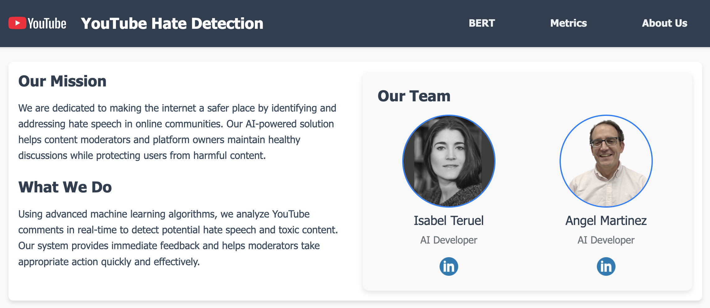
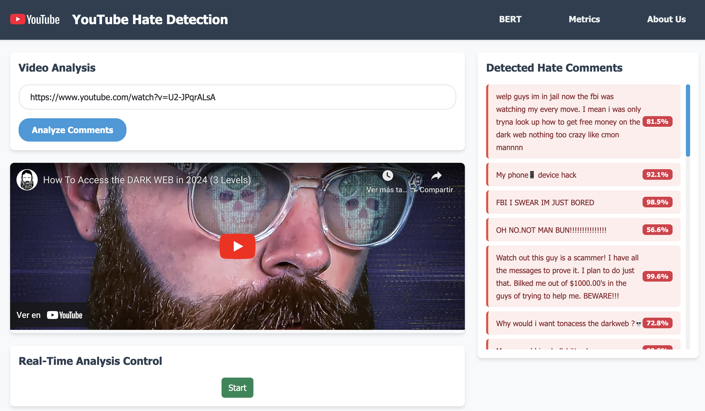

# NLP for Hate Speech Detection in YouTube Comments


## Project Overview

This project aims to develop an automated solution for detecting hate speech in YouTube comments using Natural Language Processing (NLP) techniques. The goal is to create a scalable and efficient system to improve content moderation and user experience on the platform.

## Motivation

The increasing volume of hate speech on YouTube has overwhelmed manual moderation efforts. An automated solution is crucial for:

- Scalability
- Cost-effectiveness
- Rapid response
- Improving user experience
- Maintaining YouTube's reputation

## Approach

We explored multiple approaches to solve this problem:

1. Base Model: Logistic Regression
2. Ensemble Model: VotingClassifier
3. Advanced Model: LSTM Neural Network
4. State-of-the-art Model: BERT

### Model Comparison

| Method             | Precision | Recall | F1-Score |
|--------------------|-----------|--------|----------|
| Logistic Regression| 0.69      | 0.66   | 0.68     |
| VotingClassifier   | 0.71      | 0.57   | 0.63     |
| LSTM               | 0.98      | 0.96   | 0.97     |
| BERT               | 0.71      | 0.91   | 0.80     |

## Implementation Details

### Base Model

- Used Logistic Regression for open-field text analysis
- Developed an intuitive interface using Streamlit
- Achieved 69% test accuracy with controlled overfitting of 4.2%

### Ensemble Model

- Integrated Logistic Regression, Multinomial Naive Bayes, and SVC
- Implemented URL analysis for specific YouTube comments
- Improved test accuracy to 71%, but increased overfitting to 32.99%

### LSTM Model

- Implemented recurrent neural networks for improved sequence analysis
- Used TF-IDF for text preprocessing, selecting 1000 most relevant features
- Achieved 98% accuracy and 97% F1 Score, surpassing previous models

### BERT Model

- Utilized Hugging Face transformers for sophisticated NLP
- Implemented MySQL database for result storage and long-term performance improvement
- Migrated to Django for a robust and scalable structure with ORM integration
- Used Docker for easy deployment and scalability in production

## Project Structure
```
django/
├── advanced/
│   ├── __pycache__/
│   ├── migrations/
│   ├── models/
│   ├── templates/
│   │   └── advanced/
│   │       ├── about.html
│   │       ├── base.html
│   │       ├── lstm.html
│   │       ├── metrics.html
│   │       └── video_analysis.html
│   ├── __init__.py
│   ├── admin.py
│   ├── apps.py
│   ├── check_config.py
│   ├── lstm_model.py
│   ├── ml_lstm_model.py
│   ├── ml_models.py
│   ├── models.py
│   ├── tasks.py
│   ├── tests.py
│   ├── train_model.py
│   ├── urls.py
│   ├── utils.py
│   └── views.py
├── hate_detection/
│   ├── __pycache__/
│   ├── __init__.py
│   ├── asgi.py
│   ├── celery.py
│   ├── settings.py
│   ├── urls.py
│   └── wsgi.py
├── static/
│   ├── css/
│   └── js/
│       ├── lstm_analysis_handler.js
│       └── video_analysis_handler.js
├── media/
├── .env
├── db.sqlite3
├── manage.py
└── youtoxic_english_1000.csv
```

## Setup and Installation

```bash
# Clone the repository
git clone https://github.com/yourusername/youtube-hate-speech-detection.git

# Navigate to the project directory
cd youtube-hate-speech-detection

# Create a virtual environment
python -m venv venv

# Activate the virtual environment
source venv/bin/activate  # On Windows, use `venv\Scripts\activate`

# Install dependencies
pip install -r requirements.txt
